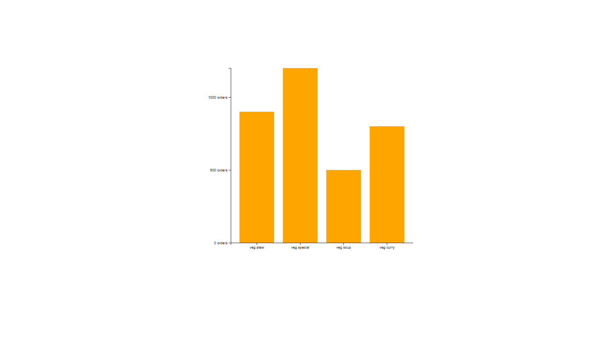
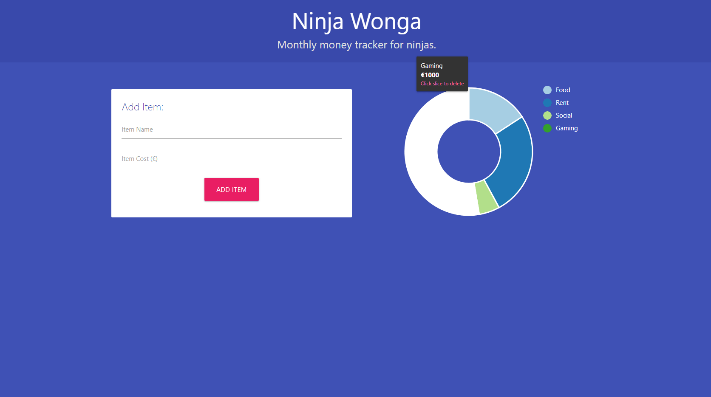
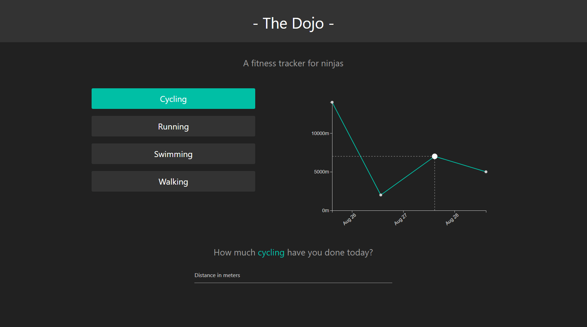
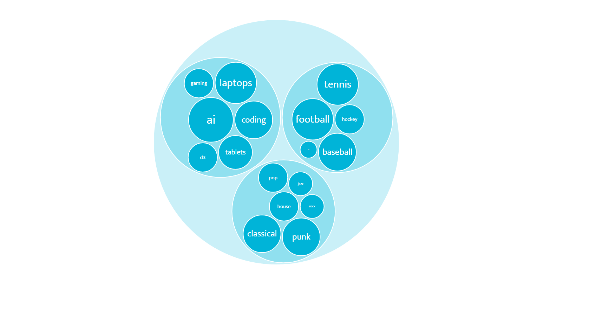
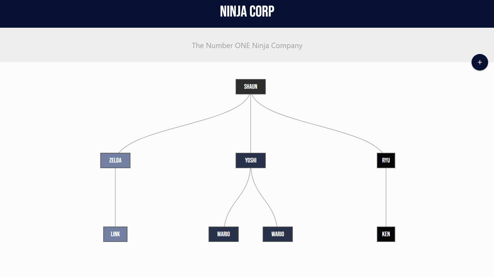

# Build Data Visualizations with D3.js & Firebase

This repo is made of 5 projects:

1. [**Bar Chart**](#barchart): A simple bar graph to understand D3.js basics using Firebase.
2. [**Pie Chart**](#piechart): A budget planner displaying a donut chart with Materialize.
3. [**Line Graphs**](#linegraphs): A fitness tracker displaying line graphs.
4. [**Bubble Chart**](#bubblechart): A circle packing diagram to learn data hierarchy.
5. [**Tree Diagram**](#treediagram): A hierarchical chart using Materialize.

## 1) Bar Chart

A simple bar graph to understand D3.js basics using Firebase.

[See bar-chart folder](https://github.com/solygambas/d3-firebase/tree/main/bar-chart)

    

### Features

- creating simple SVG shapes and appending them to the DOM with D3.js.
- changing attributes with .attr() and grouping elements together.
- joining JSON data to elements and adding virtual elements to the DOM.
- using linear and band scales with min, max and extent.
- creating a bar chart: centering a graph, adding axes and formatting ticks.
- creating a Firestore database, setting up the Firebase config and getting data from Firestore.
- understanding the D3 update pattern and using Firestore realtime data updates.
- adding D3 transitions and custom tweens.

## 2) Pie Chart

A budget planner displaying a donut chart with Materialize.

[See pie-chart folder](https://github.com/solygambas/d3-firebase/tree/main/pie-chart)

    

### Features

- creating an HTML template with Materialize.
- handling a form and adding data to Firestore.
- setting up a pie chart and generating arc paths with D3.
- generating colors with ordinal scales.
- customizing arc tween and adding legends with d3-legend.
- handling events: mouseOver, mouseOut and click.
- adding tooltips with d3-v6-tip.

## 3) Line Graphs

A fitness tracker displaying line graphs.

[See line-graphs folder](https://github.com/solygambas/d3-firebase/tree/main/line-graphs)

    

### Features

- creating an HTML template with Materialize.
- handling DOM events and adding data to Firestore.
- using time scales and formatting dates with D3.
- filtering data by activity and sorting data by date.
- generating line paths and adding data point hover effect.

## 4) Bubble Chart

A circle packing diagram to learn data hierarchy.

[See bubble-chart folder](https://github.com/solygambas/d3-firebase/tree/main/bubble-chart)

    

### Features

- handling data hierarchy in D3 with stratify() method.
- adding value property to nodes with sum().
- creating circle packs with pack() and descendants().
- displaying tags in node leaves.
- generating colors according to node depth.

## 5) Tree Diagram

A hierarchical chart using Materialize.

[See tree-diagram folder](https://github.com/solygambas/d3-firebase/tree/main/tree-diagram)

<!-- 

    

 -->

### Features

- creating an HTML template and a modal with Materialize.
- handling a form and adding data to Firestore.

Based on [Build Data Visualizations with D3.js & Firebase](https://www.udemy.com/course/build-data-uis-with-d3-firebase/) by Shaun Pelling - The Net Ninja (2019)
